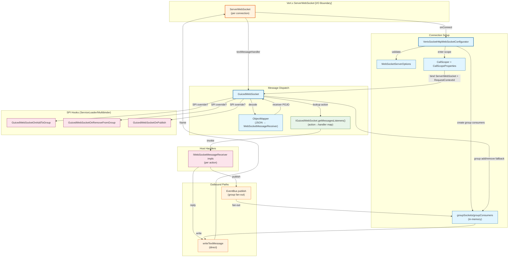

# C4 Component Diagram — WebSocket Message Routing

**Level 3: Component Architecture**

Component view based on current classes (`VertxSocketHttpWebSocketConfigurator`, `GuicedWebSocket`, `WebSocketServerOptions`, `CallScoper`, SPI hooks).

## Component Responsibilities

### Connection Setup
| Component | Responsibility |
|-----------|----------------|
| **VertxSocketHttpWebSocketConfigurator** | Registers the WebSocket handler, sets up group listeners, scopes connections, and cleans up on close/exception |
| **WebSocketServerOptions** | Validates compression/frame/chunk limits before attaching handler |
| **groupSockets / groupConsumers** | Track active sockets and EventBus consumers per group and per `RequestContextId` |
| **CallScoper + CallScopeProperties** | Enter/exit scoped context; bind `ServerWebSocket` and `RequestContextId` for downstream handlers |

### Message Dispatch
| Component | Responsibility |
|-----------|----------------|
| **GuicedWebSocket** | Decodes JSON payloads to `WebSocketMessageReceiver`, stamps broadcast group, dispatches to action handlers |
| **ObjectMapper** | Deserializes text messages; throws on malformed input |
| **MessagesListeners Map** | Registry (action → receiver handler) leveraged by `IGuicedWebSocket` |

### SPI Hooks
| Hook | Purpose |
|------|---------|
| **GuicedWebSocketOnAddToGroup** | Optional override when joining a group; can short-circuit default group map |
| **GuicedWebSocketOnRemoveFromGroup** | Optional override for removal |
| **GuicedWebSocketOnPublish** | Optional override for broadcast |

### Host Handlers
| Component | Responsibility |
|-----------|----------------|
| **IWebSocketMessageReceiver implementations** | Handle specific actions; may respond directly or publish to groups |

### Outbound Paths
| Path | Behavior |
|------|----------|
| **writeTextMessage** | Direct write to current socket (used by `broadcastMessageSync` and EventBus consumer fan-out) |
| **EventBus publish** | Broadcast to all sockets registered to a group; consumer iterates `groupSockets` |

## Design Notes

- **Scope Discipline**: `processMessageInContext` re-enters `CallScoper` for every frame to ensure scoped beans reflect the current connection.
- **Failure Handling**: Exceptions during hook execution or decoding are wrapped in `WebSocketException` or logged; missing actions generate WARN without interrupting other handlers.
- **Performance**: In-memory group maps favor low-latency single-instance deployments; clustering would require replacing group maps with shared data.
- **Extensibility**: SPI hooks discovered via `ServiceLoader` by default; multibinders allow DI-provided implementations without modifying core code.

---

**See Also**
- [c4-container.md](./c4-container.md) — container view
- [sequence-websocket-lifecycle.md](./sequence-websocket-lifecycle.md) — scope entry/exit flow
- [sequence-message-routing.md](./sequence-message-routing.md) — dispatch flow
- [../IMPLEMENTATION.md](../IMPLEMENTATION.md) — code module map
