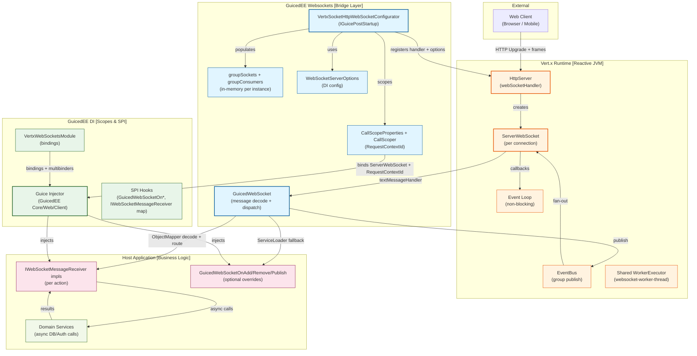

# C4 Container Diagram — GuicedEE Websockets

**Level 2: Container Architecture**

Reflects the actual containers in the current codebase (Vert.x 5, GuicedEE DI, GuicedWebSocket flow).

## Container Descriptions

### Vert.x Runtime
| Component | Responsibility |
|-----------|----------------|
| **HttpServer / ServerWebSocket** | Accepts upgrades, wires handlers via `webSocketHandler` |
| **Event Loop** | Executes callbacks; must never block |
| **EventBus** | Broadcast channel for groups; consumers registered per group |
| **WorkerExecutor** | Shared pool for blocking work (currently unused but configured) |

### GuicedEE Websockets Bridge
| Component | Responsibility |
|-----------|----------------|
| **VertxSocketHttpWebSocketConfigurator** | Startup hook; registers WebSocket handler, configures options, attaches listeners and cleanup |
| **groupSockets / groupConsumers** | In-memory tracking of connections and EventBus consumers per group or RequestContextId |
| **WebSocketServerOptions** | Runtime configuration for compression, chunk sizes, and max frames |
| **CallScopeProperties / CallScoper** | Propagate `RequestContextId`, bind `ServerWebSocket` into scope |
| **GuicedWebSocket** | Decodes JSON to `WebSocketMessageReceiver`, routes to message listeners, triggers SPI fallbacks |

### GuicedEE DI
| Component | Responsibility |
|-----------|----------------|
| **VertxWebSocketsModule** | Binds `ServerWebSocket` provider, `IGuicedWebSocket`, and multibinders for SPI hooks |
| **SPI Hooks** | `GuicedWebSocketOnAddToGroup`, `GuicedWebSocketOnRemoveFromGroup`, `GuicedWebSocketOnPublish`, message listener registry |
| **Injector** | Supplies handlers per scoped request; respects `CallScope` |

### Host Application
| Component | Responsibility |
|-----------|----------------|
| **Message Handlers** | Implement `IWebSocketMessageReceiver` keyed by action; handle decoded payloads |
| **Group Hooks** | Override default group lifecycle when provided |
| **Domain Services** | Async integrations (DB/Auth/Cache) invoked by handlers |

## Communication Flow

1. Injector starts; `VertxSocketHttpWebSocketConfigurator` registers `webSocketHandler` and validates `WebSocketServerOptions`.
2. On connection, `CallScoper` enters scope, binds `ServerWebSocket`, sets `RequestContextId`, and registers default group consumers (`EveryoneGroup` + per-connection group).
3. Text frames trigger `processMessageInContext`, which re-enters scope and delegates to `GuicedWebSocket`.
4. `GuicedWebSocket` decodes JSON to `WebSocketMessageReceiver`, stamps `broadcastGroup` to the request context, and dispatches to registered message listeners; missing actions log a warning.
5. Group broadcasts either run SPI overrides or publish to `groupSockets`/EventBus; cleanup removes sockets/consumers on close.

## Boundaries & Risks

| Boundary | Guardrail | Residual Risk |
|----------|-----------|---------------|
| Event loop ↔ blocking work | Use `WorkerExecutor`/`executeBlocking` for heavy I/O | Latency spikes if handlers block directly |
| In-memory group maps ↔ high fan-out | `WebSocketServerOptions.maxGroupSize`; warn on missing group | Memory pressure under large group counts |
| SPI hooks via ServiceLoader ↔ user code | Exceptions wrapped in `WebSocketException` and logged | User handlers may still block or throw |
| JSON decode ↔ malformed input | Jackson exceptions propagated as errors; logged in `receiveMessage` | Malformed frames drop message; client not notified |

---

**See Also**
- [c4-context.md](./c4-context.md) — system context
- [c4-component-websocket.md](./c4-component-websocket.md) — component detail and SPI interaction
- [sequence-websocket-lifecycle.md](./sequence-websocket-lifecycle.md) — connection lifecycle
- [sequence-message-routing.md](./sequence-message-routing.md) — message dispatch
- [../RULES.md](../RULES.md) — constraints and forward-only policy
