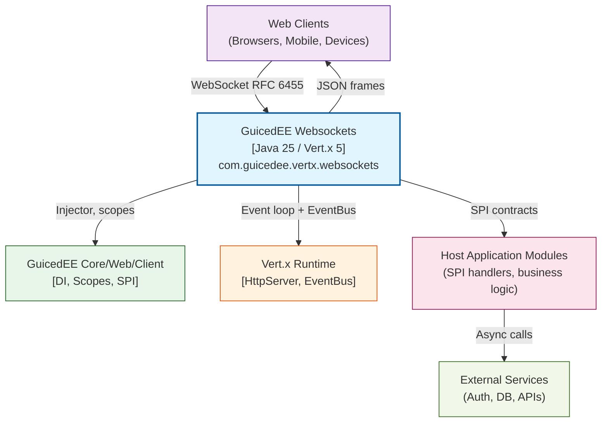

# C4 Context Diagram — GuicedEE Websockets

**Level 1: System Context**

Context of the GuicedEE Websockets library inside a GuicedEE host application. Aligned to current source (`GuicedWebSocket`, `VertxSocketHttpWebSocketConfigurator`, `WebSocketServerOptions`).

## System Responsibilities

| Actor / System | Responsibility |
|----------------|----------------|
| **Web Clients** | Initiate WebSocket upgrades and exchange JSON frames |
| **GuicedEE Websockets** | Owns connection lifecycle, group membership, message dispatch, and broadcasting |
| **GuicedEE (DI/Scopes)** | Provides injector, `CallScoper`, `CallScopeProperties`, and SPI discovery |
| **Vert.x Runtime** | Supplies `HttpServer`, `ServerWebSocket`, worker executors, and EventBus |
| **Host Application Modules** | Supply `IWebSocketMessageReceiver` handlers and optional group hooks (`GuicedWebSocketOn*`) |
| **External Services** | Called from handlers for persistence, auth, and integrations |

## Trust Boundaries & Threat Surface

| Boundary | Trust Level | Notes / Controls |
|----------|-------------|------------------|
| Web client ↔ Vert.x upgrade | Untrusted input | Validate frame size via `WebSocketServerOptions`; reject oversized/invalid frames |
| Vert.x event loop ↔ Host handlers | Trusted API, untrusted payloads | All decoding goes through `ObjectMapper`; handler exceptions logged; avoid blocking the event loop |
| EventBus ↔ Group broadcasts | Internal but shared | Guard against group fan-out spikes; `groupSockets` is in-memory per instance |
| Host handlers ↔ External services | Depends on service | Use async clients; propagate auth context in handler code |

## Key Interactions

1. Client upgrades HTTP → WebSocket; Vert.x creates `ServerWebSocket`.
2. `VertxSocketHttpWebSocketConfigurator` scopes the connection (`CallScoper`), registers EventBus consumers, and attaches message handlers.
3. Incoming JSON frames are decoded and routed through `GuicedWebSocket` to registered `IWebSocketMessageReceiver` implementations.
4. Group operations (`addToGroup`, `removeFromGroup`, `broadcastMessage`) use SPI hooks when present, otherwise fall back to in-memory `groupSockets` + EventBus publish.
5. External calls run inside handlers; blocking work must leave the event loop (worker executor).

## Technology Stack (Visible Here)

- Protocol: WebSocket (RFC 6455) over HTTP/HTTPS
- Runtime: Java 25 LTS, Vert.x 5.x (non-blocking)
- DI/Scopes: GuicedEE Core/Web/Client
- Serialization: Jackson `ObjectMapper`
- Build: Maven; JPMS enabled

---

**See Also**
- [c4-container.md](./c4-container.md) — container-level flow and boundaries
- [../RULES.md](../RULES.md) — behavioral and technical constraints
- [../../rules/generative/backend/vertx/README.md](../../rules/generative/backend/vertx/README.md) — Vert.x async guidance
