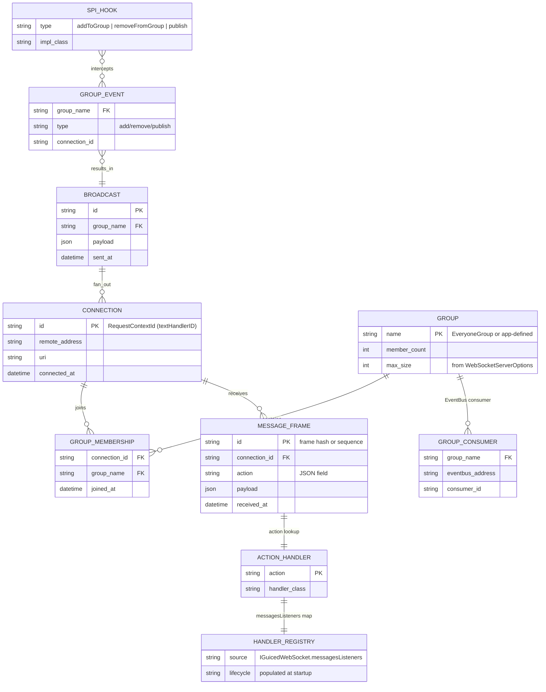

# Entity-Relationship Diagram — WebSocket Domain Model (Runtime Data)

Based on the current implementation: in-memory group tracking (`groupSockets`, `groupConsumers`, `groupCallScopeProperties`), message receiver registry, and SPI overrides.

## Entity Notes

- **CONNECTION**: Identified by Vert.x `textHandlerID`; stored in `groupCallScopeProperties` for scope propagation.
- **GROUP / GROUP_MEMBERSHIP**: Stored in-memory per JVM; created lazily on first join/broadcast. `EveryoneGroup` is always present.
- **GROUP_CONSUMER**: EventBus consumer registered per group by `configureGroupListener`; writes messages to all sockets in `groupSockets[group]`.
- **MESSAGE_FRAME**: Deserialized by Jackson into `WebSocketMessageReceiver`; `action` drives handler lookup.
- **HANDLER_REGISTRY**: Backed by `IGuicedWebSocket.getMessagesListeners()`; populated by host code, not by ServiceLoader.
- **SPI_HOOK**: Implementations discovered via `ServiceLoader` and GuicedEE `loaderToSet`; may short-circuit default group operations.
- **BROADCAST**: Represents a publish to a group; delivered through EventBus consumer to each `ServerWebSocket`.

## Runtime Constraints

| Constraint | Source | Enforcement |
|------------|--------|-------------|
| `maxGroupSize > 0` | `WebSocketServerOptions` | Validate during HttpServerOptions build |
| Compression level 0–9 | `WebSocketServerOptions` | Validate before registering handler |
| Group exists before broadcast | `broadcastMessage` | Creates placeholder + WARN if missing |
| Scope exit after message | `processMessageInContext` | `eventually(callScoper::exit)` |

## Trust & Ownership

- **Connection data**: ephemeral, per instance; cleared on close/exception handler.
- **Groups**: in-memory only; clustering would require shared data provider.
- **Handlers/Registry**: owned by host application; must be thread-safe and non-blocking.
- **SPI Hooks**: user-provided; failures propagate as `WebSocketException` but do not skip cleanup.

---

**See Also**
- [c4-container.md](./c4-container.md) — container-level flow
- [sequence-websocket-lifecycle.md](./sequence-websocket-lifecycle.md) — scope and cleanup
- [sequence-message-routing.md](./sequence-message-routing.md) — dispatch path
- [../IMPLEMENTATION.md](../IMPLEMENTATION.md) — module map and SPI wiring
