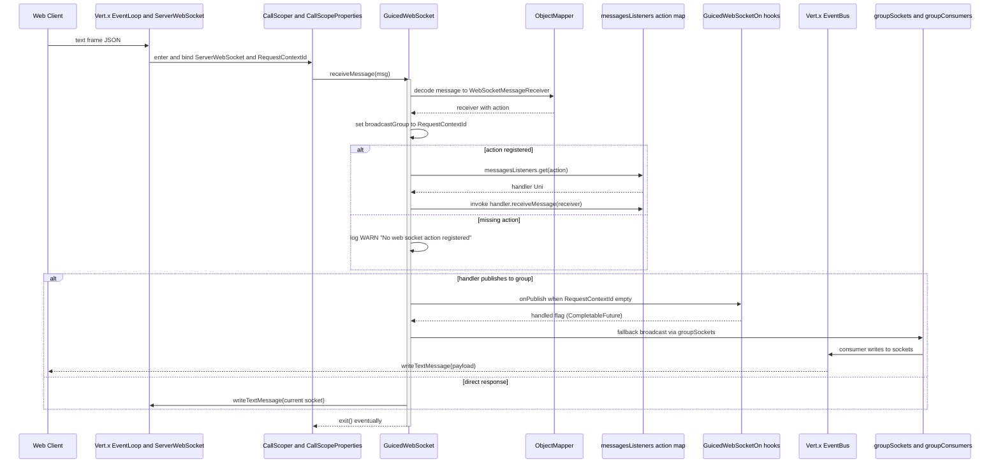

# Sequence Diagram — WebSocket Message Routing & Handler Dispatch

Critical flow for a single text frame: decode, dispatch to registered listeners, optional broadcast via groups/EventBus. Mirrors `GuicedWebSocket.receiveMessage` and `VertxSocketHttpWebSocketConfigurator.processMessageInContext`.

## Execution Model

- **Single action dispatch**: `messagesListeners` maps the `action` field to a single handler; no fan-out by default.
- **Group publish path**: `broadcastMessage` first consults SPI `GuicedWebSocketOnPublish`; if none handle it, it iterates `groupSockets` and writes messages.
- **ServiceLoader vs DI**: Hooks use `ServiceLoader` and `IGuiceContext.loaderToSet`; message listeners come from the static registry in `IGuicedWebSocket`.
- **Scope lifecycle**: `processMessageInContext` rebinds `ServerWebSocket` into scope per message; `eventually(callScoper::exit)` guarantees exit even on failure.

## Error Semantics

| Failure | Behavior |
|---------|----------|
| JSON decode fails | Throws RuntimeException; logged via `onFailure` hook; scope exit still occurs |
| Missing action | WARN logged; returns void (no response) |
| Hook throws | Wrapped in `WebSocketException` or propagated to caller; broadcast falls back to default if hook returns false |
| EventBus consumer missing group | Creates placeholder group and logs WARN |

## Performance Considerations

- Keep handlers non-blocking; use `vertx.executeBlocking` or `WorkerExecutor` for I/O.
- Large groups increase iteration cost in `groupSockets`; tune `maxGroupSize` and compression.
- ObjectMapper reuse avoids allocation churn; ensure it stays singleton via GuicedEE DI.

---

**See Also**
- [sequence-websocket-lifecycle.md](./sequence-websocket-lifecycle.md) — connection/scope lifecycle
- [c4-component-websocket.md](./c4-component-websocket.md) — component responsibilities
- [../RULES.md](../RULES.md) — async and SPI requirements
