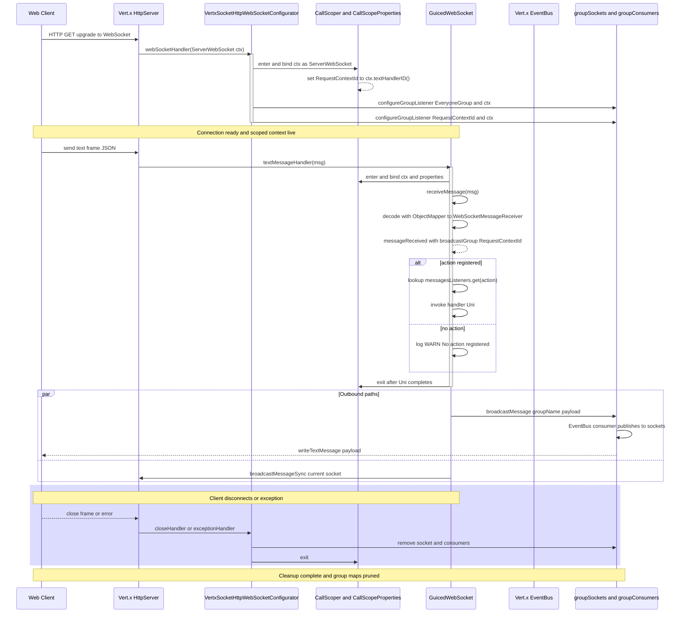

# Sequence Diagram — WebSocket Connection Lifecycle

Critical flow from HTTP upgrade through scope management, group registration, steady-state messaging, and cleanup (mirrors `VertxSocketHttpWebSocketConfigurator` + `GuicedWebSocket`).

## Lifecycle Notes

- **Scope Entry/Exit**: Every text frame re-enters `CallScoper` to refresh scoped beans; `eventually(callScoper::exit)` ensures cleanup.
- **Group Registration**: Default groups are `EveryoneGroup` and the per-connection `RequestContextId`; additional groups use SPI hook first, then fall back to `groupSockets`.
- **Failure Handling**: Exceptions during hook or handler execution wrap in `WebSocketException` or log; cleanup still runs.
- **Backpressure**: Vert.x handles TCP backpressure; handlers must avoid blocking to keep the event loop responsive.

---

**See Also**
- [sequence-message-routing.md](./sequence-message-routing.md) — dispatch detail
- [c4-component-websocket.md](./c4-component-websocket.md) — component responsibilities
- [../RULES.md](../RULES.md) — async and scope rules
